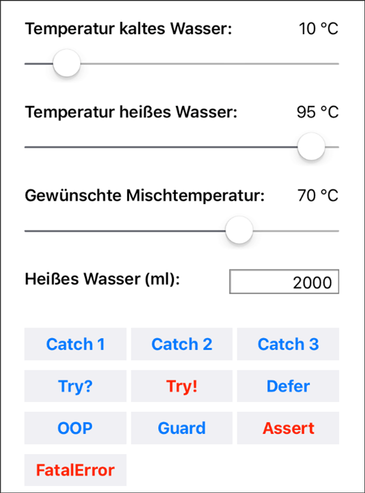
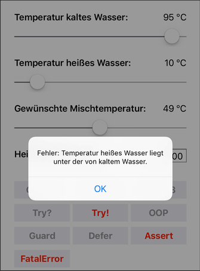
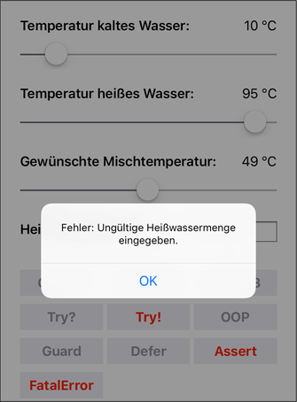

# MischTempApp #

 

Einfache iOS-App zur Demonstration verschiedener Möglichkeiten der Fehlerbehandlung.
Bitte auch die im Repository enthaltenen Playgrounds beachten.

Siehe auch die mit [Jazzy](https://github.com/realm/jazzy) aus den Markdown-Kommentaren im Quellcode erzeugte 
[Doku](https://MDecker-MobileComputing.github.io/iOS_MischTempApp).

 

----

## Screenshots ##

 

 

----

## License ##

 

See the [LICENSE file](LICENSE.md) for license rights and limitations (GPL).

 
